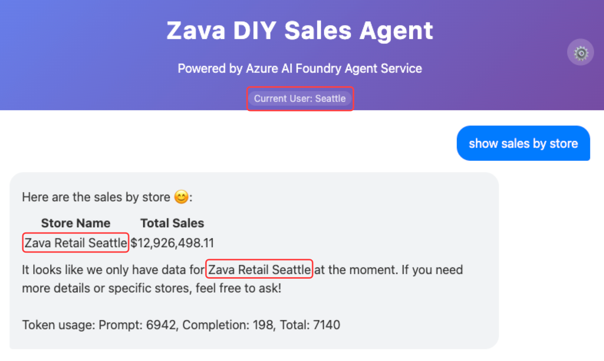

## What you'll Learn

In this lab, you'll secure agent data using the Model Context Protocol (MCP) and PostgreSQL Row Level Security (RLS). The agent has read-only database access and data is protected by user roles (head office and store manager) to ensure only authorized users can access specific information.

## Introduction

The PostgreSQL database uses Row Level Security (RLS) to control data access by user role. The web chat client defaults to the `Head office` role (full data access), but switching to `Store Manager` role restricts access to role-specific data only.

The MCP Server provides the agent with access to the Zava database. When the agent service processes user requests, the user role (UUID) is passed to the MCP server via MCP Tools Resource Headers to ensure role-based security is enforced.

In normal operation, the a store manager would authenticate with the agent and their user role would be set accordingly. But this is a workshop, and we're going to manually select a role.

??? info "For Developers: How does PostgreSQL Row Level Security work?"

    ### PostgreSQL RLS Security Overview

    Row Level Security (RLS) automatically filters database rows based on user permissions. This allows multiple users to share the same database tables while only seeing data they're authorized to access. 
    
    In this system, head office users see all data across all stores, while store managers are restricted to viewing only their own store's information. The example below shows how RLS policies are implemented for the `retail.orders` table, with identical policies applied to `retail.order_items`, `retail.inventory`, and `retail.customers` tables.

    ```sql
    CREATE POLICY store_manager_orders ON retail.orders
    FOR ALL TO PUBLIC
    USING (
        -- Head office sees all data
        current_setting('app.current_rls_user_id', true) = '00000000-0000-0000-0000-000000000000'
        OR
        -- Store managers only see their store's data
        EXISTS (SELECT 1 FROM retail.stores s WHERE s.store_id = retail.orders.store_id 
                AND s.rls_user_id::text = current_setting('app.current_rls_user_id', true))
    );
    ```

    **Result:** Store managers only see their store's data, while head office sees everything - all using the same database and tables.


    === "Python"

        You'll find the code responsible for setting the user role in the `workshop/chat_manager.py` file.

        ```python
        if request.rls_user_id:
            # Create dynamic tool resources with RLS user ID header
            mcp_tool_resource = MCPToolResource(
                server_label="ZavaSalesAnalysisMcpServer",
                headers={"x-rls-user-id": request.rls_user_id},
                require_approval="never",
            )
            tool_resources.mcp = [mcp_tool_resource]
        ```

        The code for retrieving the RLS User ID is in `mcp_server/sales_analysis/sales_analysis.py`. If the server doesn’t detect the RLS header, it defaults to the Head Office role. This fallback is intended only for workshop use and should not be applied in production.

        ```python
        def get_rls_user_id(ctx: Context) -> str:
            """Get the Row Level Security User ID from the request context."""

            rls_user_id = get_header(ctx, "x-rls-user-id")
            if rls_user_id is None:
                # Default to a placeholder if not provided
                rls_user_id = "00000000-0000-0000-0000-000000000000"
            return rls_user_id
        ```

    === "C#"

        You'll find the code responsible for setting the user role on the requests to the MCP Server in the `AgentService` class.

        ```csharp
        var mcpToolResource = new MCPToolResource(ZavaMcpToolLabel, new Dictionary<string, string>
        {
            { "x-rls-user-id", request.RlsUserId }
        });
        var toolResources = new ToolResources();
        toolResources.Mcp.Add(mcpToolResource);
        ```

        The `MCPToolResource` is then added to the `ToolResources` collection, which is provided to the streaming run using the `CreateRunStreamingOptions.ToolResources` property, this is because the RLS user ID is a dynamic value from the client (different "logged in" users may have different IDs), we need to ensure it's set on the thread _run_ rather than when the agent is created.

        As the RLS user ID is set as a header for the agent to forward to the MCP Server, this is accessed from the `HttpContext` on the request, which can be accessed from a `IHttpContextAccessor`, which is injected into the MCP tool methods. An extension method has been created, `HttpContextAccessorExtensions.GetRequestUserId`, which can be used within a tool:

        ```csharp
        public async Task<string> ExecuteSalesQueryAsync(
            NpgsqlConnection connection,
            ILogger<SalesTools> logger,
            IHttpContextAccessor httpContextAccessor,
            [Description("A well-formed PostgreSQL query.")] string query
        )
        {
            ...

            var rlsUserId = httpContextAccessor.GetRequestUserId();

            ...
        }
        ```

    ### Setting the Postgres RLS User ID

    Now the MCP Server has the RLS User ID, it needs to be set on the PostgreSQL connection.

    === "Python"

        The Python solution sets the RLS User ID on each PostgreSQL connection by calling `set_config()` within the `execute_query` method in `mcp_server/sales_analysis/sales_analysis_postgres.py`.

        ```python
        ...
        conn = await self.get_connection()
        await conn.execute("SELECT set_config('app.current_rls_user_id', $1, false)", rls_user_id)

        rows = await conn.fetch(sql_query)
        ...
        ```

    === "C#"

        The C# solution sets the RLS User ID on the PostgreSQL connection by executing a SQL command to set the RLS context variable immediately after opening the connection in the `ExecuteSalesQueryAsync` method in `SalesTools.cs`.

        ```csharp
        ...
        await using var cmd = new NpgsqlCommand("SELECT set_config('app.current_rls_user_id', @rlsUserId, false)", connection);
        cmd.Parameters.AddWithValue("rlsUserId", rlsUserId ?? string.Empty);
        await cmd.ExecuteNonQueryAsync();

        await using var queryCmd = new NpgsqlCommand(query, connection);
        await using var reader = await queryCmd.ExecuteReaderAsync();
        ...
        ```


## Lab Exercise

### Head Office role

By default, the web client operates with the `Head Office` role, which has full access to all data.

1. Enter the following query in the chat:

   ```text
   Show sales by store
   ```

   You'll see the data for all stores is returned. Perfect.

### Select a Store Manager Role

1. Switch back to the Agents' Web Chat tab in your browser.
2. Select the `settings` icon in the top right hand corner of the page.
3. Select a `Store location` from the dropdown menu.
4. Select `Save` and now the agent will operate with the selected store location's data access permissions.

   

Now the agent will only have access to the data for the selected store location.

!!! info "Note"
    Changing the user will reset the chat session, as the context is tied to the user.

Try the following query:

```text
Show sales by store
```

You'll notice that the agent only returns data for the selected store location. This demonstrates how the agent's data access is restricted based on the selected store manager role.


