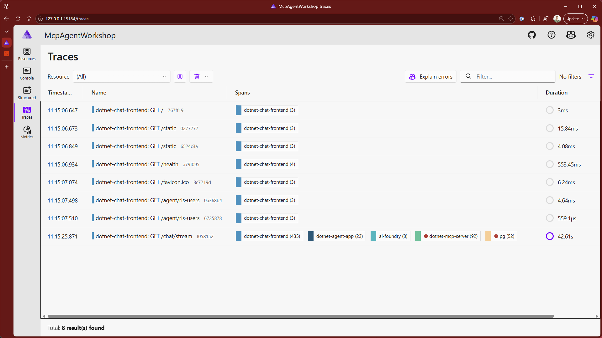
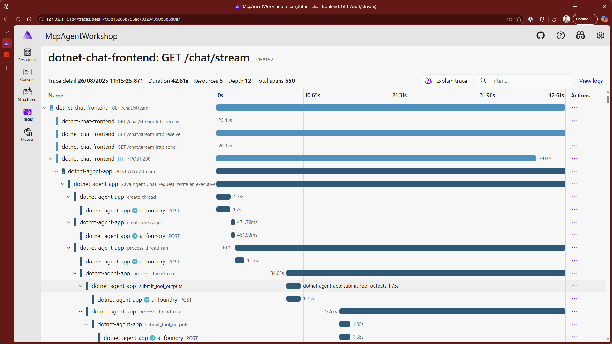
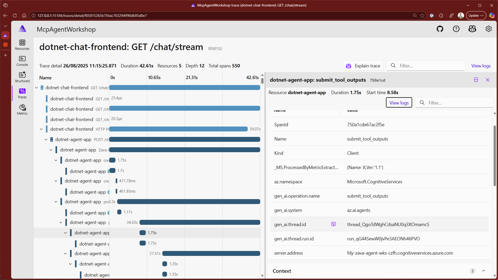

## Introduction

!!! info "Note"
    Tracing with the Aspire Dashboard is only supported in the C# version of the workshop.

So far for our tracing, we've focused on how to visualise this via the Azure AI Foundry dashboards, which can be a break in the workflow when developing locally. In addition to that, we can leverage the Aspire Dashboard to visualise the traces generated by our application in real-time, and how an action spans across multiple resources within our system.

## Run the Agent App

Launch the application by pressing <kbd>F5</kbd> and wait for the Aspire Dashboard to appear in your browser. This will show a full list of the resources in the workshop.


Like with previous lab steps, open the **Workshop Frontend** and enter a prompt into the chat, such as:

```plaintext
Write an executive report that analysis the top 5 product categories and compares performance of the online store verses the average for the physical stores.
```

## Viewing Traces

To view the traces generated by your application, navigate to the **Traces** tab in the Aspire Dashboard. Here, you can see a list of all the traces that have been captured, starting with their originator.



The final entry in the above screenshot shows the event from the **dotnet-front-end** performing a `GET` to `/chat/stream`. The **Span** column then shows the resources which this trace spans across, `dotnet-front-end`, `dotnet-agent-app`, `ai-foundry`, `dotnet-mcp-server`, and `pg`.

Each resource has a number associated with it, which is the number of _spans_ which occured for that resource. We can also note an error indicator on the `dotnet-mcp-server` and `pg` resources, which would indicate that an error occurred on those resources.

Clicking on the trace will show you a detailed view of the trace timeline:



From here, we can view the individual spans, the order in which they occured, their duration, and how events happened across resources within our application.

Clicking on an individual span will show you more details about that specific span:



Try experimenting with different prompts and simulating errors, to observe how the traces change in the Aspire Dashboard.

## Additional Reading

- [Aspire Documentation](https://aka.ms/aspire-docs)
- [Aspire Telemetry Documentation](https://learn.microsoft.com/dotnet/aspire/fundamentals/telemetry)
