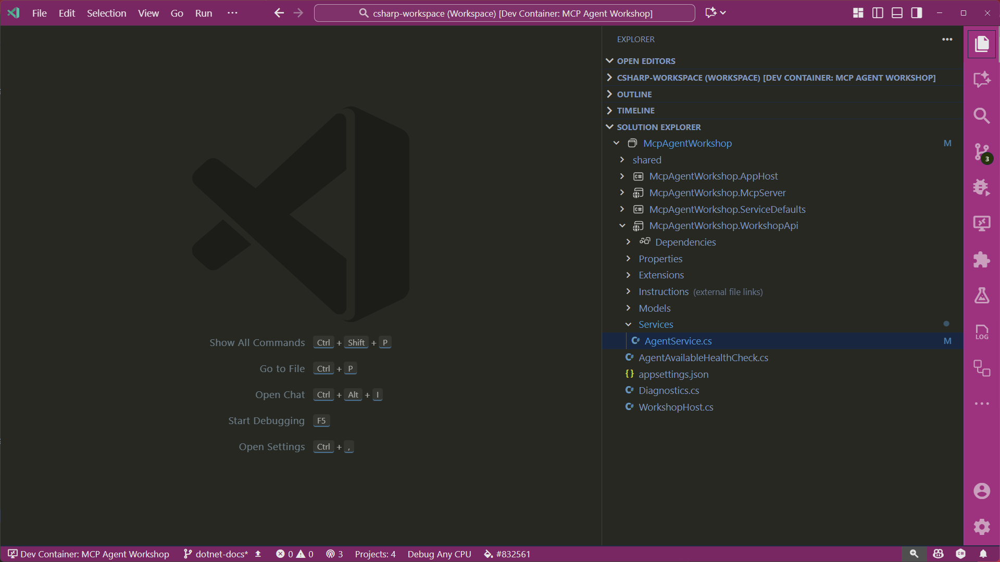

## Microsoft Event Attendees

The instructions on this page assume you are attending an event and have access to a pre-configured lab environment. This environment provides an Azure subscription with all the tools and resources needed to complete the workshop.

## Introduction

This workshop is designed to teach you about the Azure AI Agents Service and the associated [SDK](https://learn.microsoft.com/python/api/overview/azure/ai-projects-readme?context=%2Fazure%2Fai-services%2Fagents%2Fcontext%2Fcontext){:target="_blank"}. It consists of multiple labs, each highlighting a specific feature of the Azure AI Agents Service. The labs are meant to be completed in order, as each one builds on the knowledge and work from the previous lab.

## Select Workshop Programming Language

The workshop is available in both Python and C#. Please make sure to select the language that fits the lab room or preference by using the language selector tabs. Note, don't switch languages mid-workshop.

**Select the language tab that matches your lab room:**

=== "Python"
    The default language for the workshop is set to **Python**.
=== "C#"
    The default language for the workshop is set to **C#**.

## Authenticate with Azure

You need to authenticate with Azure so the agent app can access the Azure AI Agents Service and models. Follow these steps:

1. Open a terminal window. The terminal app is **pinned** to the Windows 11 taskbar.

    { width="300" }

2. Run the following command to authenticate with Azure:

    ```powershell
    az login
    ```

    !!! note
        You'll be prompted to open a browser link and log in to your Azure account.

        1. A browser window will open automatically, select **Work or school account** and then select **Continue**.
        1. Use the **Username** and **TAP (Temporary Access Pass)** found in the **top section** of the **Resources** tab in the lab environment.
        1. Select **Yes, all apps**
        1. Select **Done**

3. Then select the **Default** subscription from the command line, by selecting **Enter**.

4. Leave the terminal window open for the next steps.

## Authenticate with the DevTunnel Service

DevTunnel enables the Azure AI Agents Service to access your local MCP Server during the workshop.

```powershell
devtunnel login
```

!!! note
    You will be prompted to use the account you used for `az login`. Select the account and continue.

Leave the terminal window open for the next steps.

## Open the Workshop

Follow these steps to open the workshop in Visual Studio Code:

=== "Python"

    The following command block updates the workshop repository, activates the Python virtual environment, and opens the project in VS Code.

    Copy and paste the following command block to the terminal and press **Enter**.

    ```powershell
    ; cd $HOME\aitour26-WRK540-unlock-your-agents-potential-with-model-context-protocol `
    ; .\src\python\workshop\.venv\Scripts\activate `
    ; code .vscode\python-workspace.code-workspace
    ```

    !!! warning "When the project opens in VS Code, two notifications appear in the bottom right corner. Click ✖ to close both notifications."

=== "C#"

    1. From a terminal window, execute the following commands to update the workshop repository:

        ```powershell
        cd $HOME\aitour26-WRK540-unlock-your-agents-potential-with-model-context-protocol `
        ```

    === "VS Code"

        1. Open the workshop in Visual Studio Code. From the terminal window, run the following command:

            ```powershell
            cd $HOME\aitour26-WRK540-unlock-your-agents-potential-with-model-context-protocol `
            code .vscode\csharp-workspace.code-workspace
            ```

        !!! note "When the project opens in VS Code, a notification will appear in the bottom right corner to install the C# extension. Click **Install** to install the C# extension, as this will provide the necessary features for C# development."

    === "Visual Studio 2022"

        2. Open the workshop in Visual Studio 2022. From the terminal window, run the following command:

            ```powershell
            cd $HOME; start .\aitour26-WRK540-unlock-your-agents-potential-with-model-context-protocol\src\csharp\McpAgentWorkshop.slnx
            ```

            !!! note "You may be asked what program to open the solution with. Select **Visual Studio 2022**."

## Project Structure

=== "Python"

    Be sure to familiarize yourself with the key **subfolders** and **files** you’ll be working with throughout the workshop.

    5. The **main.py** file: The entry point for the app, containing its main logic.
    6. The **sales_data.py** file: The function logic to execute dynamic SQL queries against the SQLite database.
    7. The **stream_event_handler.py** file: Contains the event handler logic for token streaming.
    8. The **shared/files** folder: Contains the files created by the agent app.
    9. The **shared/instructions** folder: Contains the instructions passed to the LLM.

    

=== "C#"

    ## Project Structure

    Be sure to familiarize yourself with the key **subfolders** and **files** you’ll be working with throughout the workshop.

    ### The workshop folder

    - The **Lab1.cs, Lab2.cs, Lab3.cs** files: The entry point for each lab, containing its agent logic.
    - The **Program.cs** file: The entry point for the app, containing its main logic.
    - The **SalesData.cs** file: The function logic to execute dynamic SQL queries against the SQLite database.

    ### The shared folder

    - The **files** folder: Contains the files created by the agent app.
    - The **fonts** folder: Contains the multilingual fonts used by Code Interpreter.
    - The **instructions** folder: Contains the instructions passed to the LLM.

    

## Pro Tips

!!! tips
    1. The **Burger Menu** in the right-hand panel of the lab environment offers additional features, including the **Split Window View** and the option to end the lab. The **Split Window View** allows you to maximize the lab environment to full screen, optimizing screen space. The lab's **Instructions** and **Resources** panel will open in a separate window.
