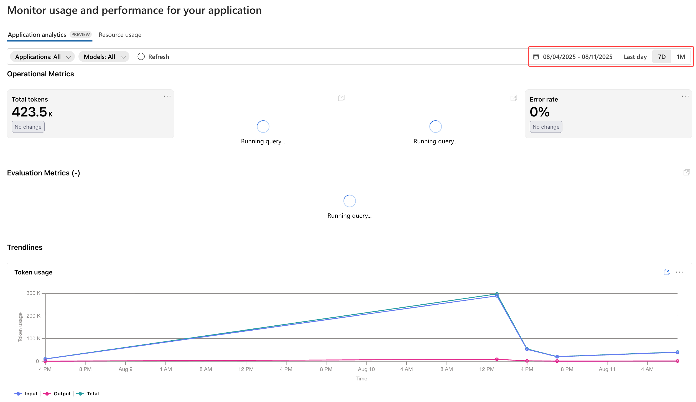

## はじめに

モニタリングは、Azure AI Foundry エージェントサービスの可用性、パフォーマンス、信頼性を維持します。Azure Monitor はメトリクスとログを収集し、リアルタイムの洞察を提供し、アラートを送信します。ダッシュボードとカスタムアラートを使用して主要メトリクスを追跡し、トレンドを分析し、プロアクティブに対応します。Azure ポータル、CLI、REST API、またはクライアントライブラリを通じてモニタリングにアクセスできます。

## ラボ演習

1. VS Code ファイルエクスプローラーから、`workshop` フォルダーの `resources.txt` ファイルを開きます。
1. `AI Project Name` キーの値をクリップボードに**コピー**します。
1. [Azure AI ポータル すべてのリソース](https://ai.azure.com/allResources) ページに移動します。
1. 検索ボックスに、コピーした `AI Project Name` を貼り付けます。
1. 検索結果から **AI Project** を選択します。

## モニタリングダッシュボードを開く

1. `resources.txt` から、`Application Insights Name` の値をクリップボードにコピーします。
1. AI Foundry ポータルに戻り、左側のメニューの **Monitoring** セクションを選択します。
1. コピーした `Application Insights Name` を `Application Insights resource name` ドロップダウンリストに貼り付けます。
1. ドロップダウンリストから **Application Insights** リソースを選択します。
1. **Connect** を選択します。

### モニタリングダッシュボードを探索

`Application analytics` ダッシュボードで利用可能な情報に慣れ親しんでください。

!!!tip "モニタリングツールに表示されるデータをフィルタリングするために日付範囲を選択できます。"

### リソース使用量の監視

さらに深く掘り下げることができます。`Resource Usage` を選択して、AI プロジェクトのリソース消費に関する詳細メトリクスを表示します。再び、時間範囲でデータをフィルタリングできます。

*GitHub Copilot を使用して翻訳されました。*
